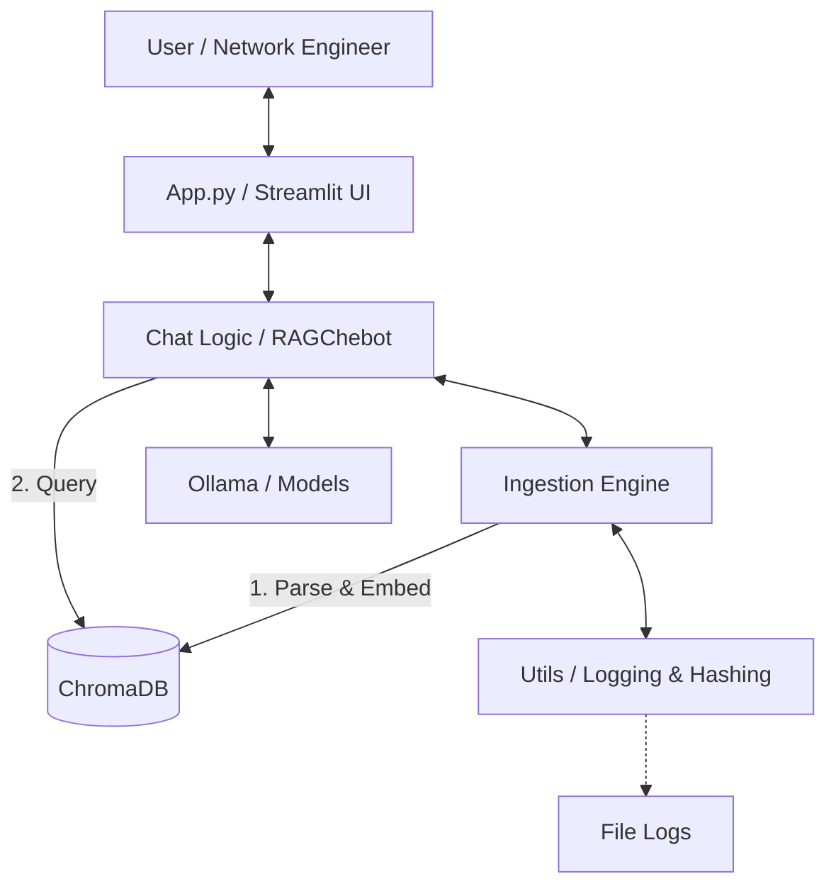

# Architecture & Design Document: Network Config RAG Chatbot

## 1. Project Overview
This application is a **Local Retrieval-Augmented Generation (RAG)** tool designed for Network Engineers. It allows users to upload network configuration files (Cisco/Aruba), index them into a vector database, and perform natural language queries or structural comparisons between "Golden" (Reference) and "Candidate" (Target) configurations.

## 2. Architecture High-Level
The application follows a modular RAG architecture, designed for local execution and data privacy.



## 3. Key Modules

### 3.1 `app.py` (Frontend)
- **Framework**: Streamlit.
- **Role**: Handles user interaction, file uploads, and session state.
- **Key Features**:
    - **Session State**: Manages `chatbot` instance, chat `messages`, and file processing status to prevent re-indexing on every rerun.
    - **Routing**: Detects if the user wants a standard Chat QA or a "Deep Compare" based on button clicks or strict prompts.
    - **Short-Circuit**: Performs a SHA256 hash check before sending data to the LLM. If hashes match, it returns an instant "Identical" response (0 latency).

### 3.2 `ingestion.py` (Data Pipeline)
- **Role**: Parses raw text configs into structured chunks and saves them to the Vector Store.
- **Workflow**:
    1.  **Read**: Opens file with utf-8 decoding.
    2.  **AST Parsing (`NetworkConfigParser`)**:
        - Instead of chunking by fixed character count (which breaks context), it chunks by **Network Block** (Feature).
        - Example: An entire `interface GigabitEthernet1/0/1` block including all its sub-commands is one chunk.
    3.  **Redaction**: Uses regex patterns to mask Type 7 passwords, SNMP communities, and keys before embedding.
    4.  **Metadata Tagging**: Extracts `hostname`, `vendor`, and `section_type` (e.g., `vlan`, `router_ospf`) for filtering.
    5.  **Logging**: Logs ingestion progress and errors to `logs/app.log` via `utils.logger`.
    6.  **Embedding**: Uses `sentence-transformers/all-MiniLM-L6-v2` locally.
    7.  **Storage**: Persists to `./chroma_db`.

### 3.3 `chat_logic.py` (RAG Brain)
- **Role**: Manages the LLM interaction and retrieval chains.
- **Key Methods**:
    - `ask(query)`: Standard QA. Retrieves relevant chunks and feeds them to the LLM.
    - `compare_configs(query)`: **Specialized Dual-Retrieval**.
        - It performs *two* separate vector searches: one filtered by `role: "golden"` and one by `role: "candidate"`.
        - This prevents the LLM from confusing the two file contexts.
        - It constructs a strict prompt telling the LLM to compare *only* the provided contexts side-by-side.

### 3.4 `utils.py` (Shared Utilities)
- **Logging**: Configures a robust logging system.
    - **Console**: StreamHandler for real-time dev feedback.
    - **File**: FileHandler writing to `logs/app.log` for persistent history.
- **Hashing**: SHA256 generation for file deduplication and modification checks.
- **Helpers**: Filename sanitation and other shared small tools.

## 4. Workflows

### Standard Ingestion
1.  User uploads a file.
2.  `compute_file_hash()` generates a unique ID.
3.  Ingestion logs start of processing.
4.  `NetworkConfigParser` breaks file into blocks.
5.  Blocks are embedded and stored in Chroma.
6.  Success/Failure is logged.

### Deep Comparison Request
1.  User clicks "Deep Compare".
2.  File Hashes are checked. If equal -> Return success immediately.
3.  If different, `RAGChatbot.compare_configs()` is called.
4.  System retrieves Top-K chunks for Golden file.
5.  System retrieves Top-K chunks for Candidate file.
6.  LLM receives prompt: *"Compare Context A (Golden) vs Context B (Candidate)"*.
7.  Result is displayed using Markdown.

## 5. Security & Privacy
- **Local Execution**: All processing happens on the user's machine (Ollama + ChromaDB). No data leaves the network.
- **Redaction**: Sensitive secrets (passwords, keys, SNMP communities) are redacted during the Ingestion phase, ensuring they are never stored in the Vector DB or sent to the LLM context.

## 6. Development Setup

### Prerequisites
- Python 3.10+
- [Ollama](https://ollama.ai/) running locally.
- `pip install -r requirements.txt`

### Running the App
```bash
streamlit run app.py
```
